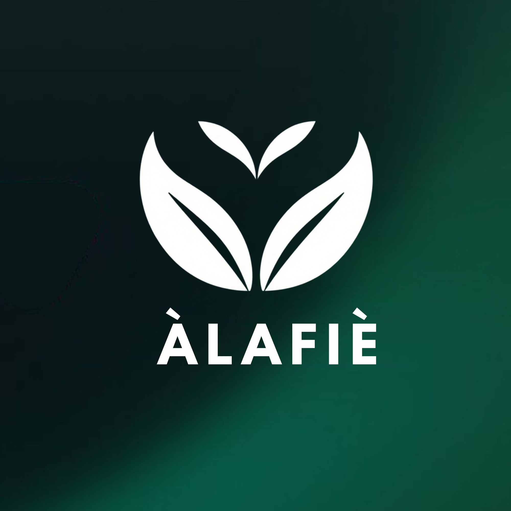

  
  <h1>Alafiè</h1>
  
<strong>Application mobile d'information et de suivi des médicaments</strong>

  
<em>« Alafiè » signifie « santé » ou « bien-être » en langue Bassar.</em>

---

## À propos

**Alafiè** est une application mobile conçue pour sécuriser et simplifier la prise de médicaments au Togo et en Afrique de l'Ouest. Face aux défis liés à l'automédication, à la complexité des notices médicales et à la couverture réseau variable, Alafiè propose un outil d'accompagnement quotidien, accessible et **pleinement fonctionnel hors-ligne**.

Tout le contenu médical est rédigé et validé par un pharmacien, garantissant une information fiable, compréhensible et sans génération automatique.

> **Avertissement :** Alafiè informe et alerte sur les risques, mais ne remplace en aucun cas une consultation, un diagnostic ou une prescription médicale, et ne commercialise aucun médicament.

---

## Fonctionnalités

### Version 1 (Socle essentiel)
- **Fiches médicaments claires :** Recherche par nom ou DCI, posologies usuelles, précautions d'emploi et effets indésirables vulgarisés.
- **Alternatives génériques :** Identification rapide des équivalents disponibles.
- **Rappels et suivi de prise :** Notifications locales programmées et suivi de l'observance, sans dépendre d'une connexion Internet.
- **Alertes et sécurité :** Détection automatique d'incompatibilités entre les traitements suivis et les allergies déclarées.
- **Pharmacies de garde :** Consultation hebdomadaire de la liste des officines de garde, disponible hors-ligne.
- **Contact pharmacien :** Formulaire de contact pour poser une question directement à l'équipe.

### Version 2 (Évolutions prévues)
- Notices audio en langues locales (éwé, mina, bassar, etc.) pour les personnes peu lectrices.
- Scan du code-barres des boîtes de médicaments.
- Géolocalisation des pharmacies sur carte interactive.
- Comparateur indicatif des prix officiels.

---

## Architecture & Protection des données

Alafiè applique une démarche stricte de **Privacy by Design** et d'architecture **Offline-First** :

* **Données de santé strictement locales :** Le profil de santé, les allergies et l'historique des prises restent sur le smartphone et sont chiffrés localement. Aucune donnée de santé n'est transmise à un serveur distant en V1.
* **Fonctionnement hors-ligne garanti :** Les fiches et la logique de détection des risques fonctionnent en autonomie complète, sans connexion Internet permanente requise.
* **Mises à jour asynchrones :** Les fiches publiées depuis le back-office sont téléchargées en arrière-plan dès qu'une connexion réseau est détectée, sans perturber l'expérience utilisateur.
* **Conformité réglementaire :** Démarche alignée avec la loi togolaise n° 2019-014 relative à la protection des données à caractère personnel (IPDCP).

---

## Choix techniques

| Composant | Technologie retenue | Rôle |
| :--- | :--- | :--- |
| **Application Mobile** | Flutter (Dart) | Client multiplateforme (Android prioritaire), logique hors-ligne |
| **Stockage local** | SQLite chiffré (SQLCipher) | Base de données locale sécurisée pour le profil et les fiches |
| **Notifications** | Notifications locales de l'OS | Alertes de prise fiables même appareil verrouillé et sans réseau |
| **Back-office** | Web (Node.js & PostgreSQL) | Espace de rédaction et de validation des fiches pour le pharmacien |

---

## Équipe projet

* **Mario-Francisco d'ALMEIDA** — Développement de l'application mobile
* **Mathis AHIANLE** — Développement du back-office et intégration des données
* **Odilon DJADOU** — Sécurité, chiffrement et conformité
* **Habib TANTE-OUYI** — Rédaction et validation du contenu médical

---

## Contexte & Références

Ce projet s'appuie sur les constats de terrain documentés au Togo :
- Étude sur l'automédication dans les officines de Lomé (Université de Lomé)
- Taux d'alphabétisation des adultes (Banque mondiale / UNESCO)
- Données d'accès aux réseaux mobiles et Internet au Togo (DataReportal / StatCounter)
- Loi n° 2019-014 du 29 octobre 2019 relative à la protection des données à caractère personnel (Togo)
